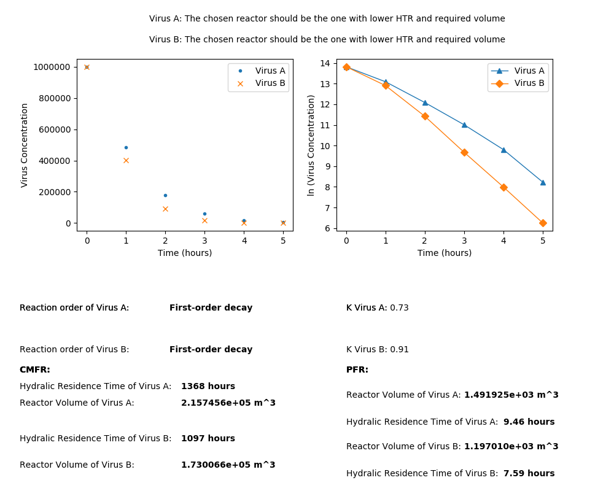

# Sunlight Disinfection System

---

This program calculate what is the reaction order of the virus, once that is been confirmed it calculated the following in order to Judge which Reactor is best to be used.
* Hydraulic Residence Time
* Required Volume
* Decay rate coefficient

Assumptions:
* The input flowrate is assumed to be in Million Gallon per Day (MGD).
* Concentration of Virus is in Number of virus per milliletre (#/mL) unit.
* Time Points is in Hours (hr) unit.
* The data input by user should be in correct format as shown below.

Inputs:
* Virus concentration vs time data excel sheet
* Desired Inactivation rate
* Flowrate in MGD
Outputs:
Image that contains the following data:
* Hydraulic Residence Time
* Required Volume
* Decay rate coefficient
* Preffered Reactor


## Setup

In order to use the program, you have to clone/download this repository,
navigate to the local directory and create a virtual environment with:

```
$ python3 -m venv venv
```

Then, activate the virtual environment:

```
For Linux/Mac OS:
$ source venv/bin/activate

For Windows:
> venv\Scripts\activate
```

Finally, install the required libraries for this program with:

```
$ pip install -r requirements.txt
```


## How to use the program

Produce an excel sheet containing virus concentration vs time data. It should have columns like shown below:

| Time (hours) | Virus A  | Virus B  | . |
|--------------|----------|----------|---|
| 0            | 1 x 10^5 | 1 x 10^6 | . |
| 1            | 1 x 10^4 | 1 x 10^4 | . |
| 2            | 1 x 10^3 | 1 x 10^4 | . |
| .            | .        | .        | . |

Store this excel sheet in the input folder. Similar to how example sheets are currently stored. 

Run the program by following command: 

```python
python source.py -i {excel_sheet_name} -r 99.9 -f 1
```
* -i: represents input excel file without extension name. This is stored in input directory. If file name is virus_1.xlsx, input virus_1
* -f: represents inactivation rate, upto three (3) precision. Above is 99.9% 
* -f: represents flow rate in MGD

The code will run now and ouput a plot with all results and also store it in output with the name of the input excel file. 

# Sample Output

